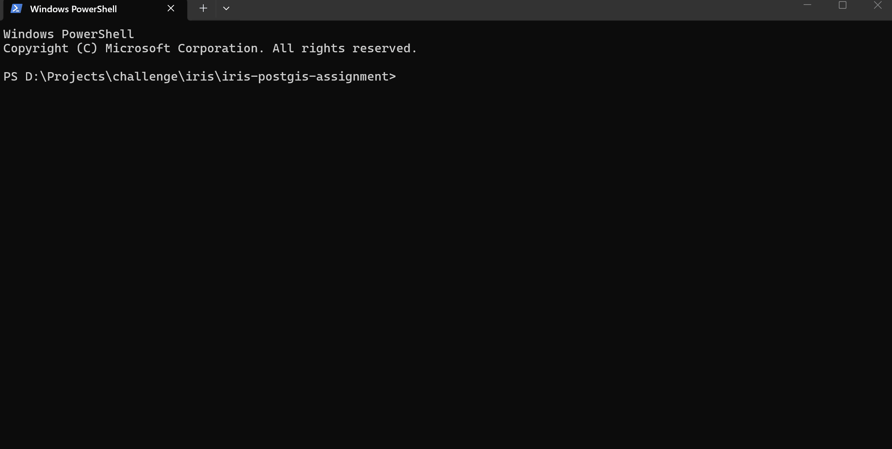

# IRIS PostGIS Pilot

Implementation of the Project IRIS PostgreSQL/PostGIS technical assignment.

Detailed architecture, schema, data contracts, and production evolution are in `docs/`.

# Quick start (Docker only)

Run this from the project root in PowerShell, CMD, Bash, or Zsh:

```text

docker compose run --rm runner all

```



The command starts PostgreSQL, waits for its healthcheck, rebuilds the IRIS schemas,

loads and promotes fixtures, persists screening evidence, runs verification, and

executes the tests.

It stops on the first failure and returns a non-zero exit code.

**`all`, `rebuild`, and `reset` delete existing data in `iris_core` and `iris_staging`.**

They preserve the PostGIS installation and named Docker volume.

## Prerequisites

- Docker Desktop, or Docker Engine with Docker Compose v2, running Linux containers.

- Docker must be running and have access to this project folder.

- Network access for the initial image download; cached images can be reused.

- The image runs as `linux/amd64`. ARM hosts require Docker's amd64 emulation.

No host Make, Python, PostgreSQL client, or separate Ubuntu distribution is required.

Docker Desktop on Windows may itself use WSL 2 as its backend; commands can still

run directly from PowerShell or CMD.

The database image supplies PostgreSQL 16 and PostGIS 3.4. No external production

credentials, paid APIs, or proprietary datasets are required.

# Commands

## Docker Compose (recommended)

```text

docker compose run --rm runner

```

With no argument, the runner displays help. Compose may start the database dependency,

but the help command does not change application schemas or data.

Use `docker compose run --rm runner COMMAND` for:

| Command | Behavior |

|---|---|

| `help` | Show usage and reset warning |

| `reset` | Drop only `iris_core` and `iris_staging` |

| `migrate` | Run the six schema migrations in order |

| `seed` | Load deterministic staging fixtures |

| `promote` | Normalize and promote staging data into core |

| `screening` | Persist deterministic spatial evidence from core data |

| `rebuild` | Reset → migrate → seed → promote → screening |

| `verify` | Run the three read-only verification files |

| `test` | Run the three automated SQL test files in numeric order |

| `all` | Rebuild → verify → test |

Migrations define structure only: they do not load fixtures or execute screening.

Use `rebuild` for an existing database; `migrate` expects schemas not already created.

Verification and tests require a completed rebuild. Do not run rebuild/reset alongside

other database commands against the same Compose project.

Typical individual commands:

```text

docker compose run --rm runner rebuild

docker compose run --rm runner screening

docker compose run --rm runner verify

docker compose run --rm runner test

```

Run an individual test file after a completed rebuild:

```text

docker compose run --rm --entrypoint psql runner -X -v ON_ERROR_STOP=1 -f tests/001_constraints.sql

docker compose run --rm --entrypoint psql runner -X -v ON_ERROR_STOP=1 -f tests/002_geometry.sql

docker compose run --rm --entrypoint psql runner -X -v ON_ERROR_STOP=1 -f tests/003_screening.sql

```

Start only the database, inspect its status, or open an interactive SQL session:

```text

docker compose up -d --wait --wait-timeout 60 db

docker compose ps

docker compose exec db psql -X -U iris -d iris

```

Stop services while preserving the database volume:

```text

docker compose down

```

## Makefile (optional)

All existing Make targets remain available. These shortcuts require GNU Make and a

POSIX shell; Windows users can use a suitably configured WSL development distribution.

They delegate SQL operations to the same container runner, without duplicating SQL order.

```text

make up

make rebuild

make verify

make test

```

Additional targets: `help`, `down`, `status`, `psql`, `wait-db`, `reset`, `migrate`,

`seed`, `promote`, `screening`, and `all`. `make all` performs the complete workflow.

`up` and `wait-db` start the database if necessary and wait up to 60 seconds for health.

The rebuild sequence stays ordered even under `make -j4 rebuild`.

## Optional host database access

By default PostgreSQL has no published host port, avoiding conflicts with another

local database. The runner connects internally to `db:5432`.

For a GUI database client, explicitly enable localhost access:

```text

docker compose -f docker-compose.yml -f docker-compose.host.yml up -d --wait db

```

Connect to `127.0.0.1:5432`, database/user/password `iris`. These are local demo

credentials. To choose a different port, create a project-root `.env` file containing:

```dotenv

IRIS_DB_PORT=55432

```

Use the same two `-f` arguments for subsequent Compose commands when retaining host

access. The host override is optional and is not needed for the reviewer workflow.

## Troubleshooting and portability

- If Docker cannot connect to its daemon, start Docker Desktop or the Docker service.

- Use Linux-container mode; this image cannot run as a Windows container.

- If the project mount is denied, allow Docker to access the project folder.

- If the database is unhealthy, inspect `docker compose logs db`.

- If image download fails, check network/proxy access to Docker Hub.

- On ARM, ensure amd64 emulation is available; native ARM execution is not claimed.

Shell scripts are stored with LF endings via `.gitattributes` and run through `/bin/sh`,

so host executable permissions and host shell syntax are not required.

---

# Assumptions

## Parcel is the primary screening subject

`parcel` is treated as the entity evaluated by the BESS and peatland screening flows.

This is an implementation interpretation of the assignment context.

## Fixture data is synthetic

The assignment does not provide a required production dataset or required external file format.

The implementation therefore uses small deterministic local SQL fixtures.

The PDF permits seed SQL or a Python loader. This submission uses SQL fixtures and

does not require a Python application.

The PDF also mentions Python 3.12+ in its general stack constraints. This submission

interprets the explicit seed-SQL option as permitting the SQL-first pilot; that stack

wording remains an acknowledged ambiguity.

Promotion is insert-only for immutable demo fixtures. Repeating promotion does not

update existing business records. Rebuild after changing fixtures.

These records do not represent real cadastral, grid, peatland, environmental, or planning sites.

## Staging is more permissive than core

`iris_staging` stores incoming/source-shaped records.

`iris_core` stores validated canonical records.

Staging geometry may therefore preserve incoming source CRS and broader geometry typing,

while promotion enforces the stricter core contracts.

## `country_code` is mandatory before persistence

Every persisted business entity must have a non-null `country_code`.

Records without a country code are rejected rather than inserted into the staging business tables.

A production ingestion pipeline could capture such rejected records separately.

## EPSG:4326 is the canonical core CRS

Core geometry is normalized to EPSG:4326 for interoperability.

One staging substation fixture intentionally uses EPSG:25832 so that the promotion

flow demonstrates an actual:

```sql

ST_Transform(..., 4326)

```

Metric calculations do not interpret EPSG:4326 coordinate degrees as metres.

## Screening layers are generic

The assignment does not define specific screening-layer categories.

The implementation therefore uses a generic `screening_layer` entity with a `layer_type`.

## Screening thresholds are demonstration values

Any proximity threshold used in fixtures, verification, or tests exists only to

demonstrate spatial behavior.

It is not treated as an authoritative IRIS production rule.

## Spatial relationships are computed

Relationships such as:

- parcel ↔ peatland

- parcel ↔ substation

- parcel ↔ screening layer

are derived from geometry using PostGIS functions rather than modeled as ordinary foreign keys.

After promotion, the `screening` stage persists positive results in `iris_core.evidence`.

For the deterministic fixtures it stores peatland and screening-layer intersections

and the distance to a substation within the 500 m demonstration threshold. Running

screening again updates the same logical evidence rows instead of duplicating them.

---

# Architecture Choices

## Why separate staging and core?

`iris_staging` isolates incoming source-shaped data from the trusted canonical model.

`iris_core` contains validated, normalized records used by downstream screening queries.

This allows ingestion concerns to evolve independently from canonical business data.

## Why use surrogate primary keys?

Each core entity uses an internal numeric `id` as a primary key.

This keeps internal references simple.

Business identity is enforced separately with country-scoped composite unique constraints.

Example:

```text

UNIQUE (country_code, source_id, parcel_ref)

```

## Why use country-scoped composite foreign keys?

Country-sensitive relationships include `country_code` so PostgreSQL can reject

accidental cross-country references.

Example:

```text

(country_code, source_run_id, source_id, source_date)

→ source_run(country_code, id, source_id, source_date)

```

and:

```text

evidence(country_code, parcel_id)

→ parcel(country_code, id)

```

Spatial entities must match their source run's source ID and date as well as its

country. Evidence retains a country-scoped source-run reference.

## Why use EPSG:4326 for canonical storage?

EPSG:4326 provides a simple interoperable storage CRS for the pilot.

Incoming source geometry may use another CRS and is normalized during promotion.

Metric operations use `geography` or an appropriate projected CRS rather than

assuming degrees are metres.

## Why use GiST indexes?

Core screening queries use PostGIS predicates such as:

```sql

ST_Intersects(...)

ST_DWithin(...)

```

GiST indexes are therefore added to the core geometry columns used by these queries.

The substation `geom::geography` expression also has a GiST index matching the

metre-based proximity predicate. Geometry indexes support the intersection queries.

The fixture dataset is intentionally small, so PostgreSQL may still choose a sequential

scan in demonstration query plans.

## Why use SQL first?

The assignment primarily evaluates:

- DDL correctness

- key and constraint design

- spatial design

- reproducibility

- documentation

SQL therefore remains the primary implementation language.

No ORM, API server, frontend, or application framework is required for the minimal pilot.

## Why use Docker Compose?

Docker Compose provides a reproducible local PostgreSQL/PostGIS environment and avoids

requiring reviewers to manually configure matching database versions.

Docker is an environment choice, not part of the domain model.

---

# Detailed Documentation

- `docs/architecture.md` — overall system architecture

- `docs/schema.md` — relational schema and key design

- `docs/spatial-screening.md` — spatial workflows

- `docs/data-contracts.md` — completeness, CRS, units, source date, uncertainty

- `docs/production-evolution.md` — deliberate simplifications and production evolution
