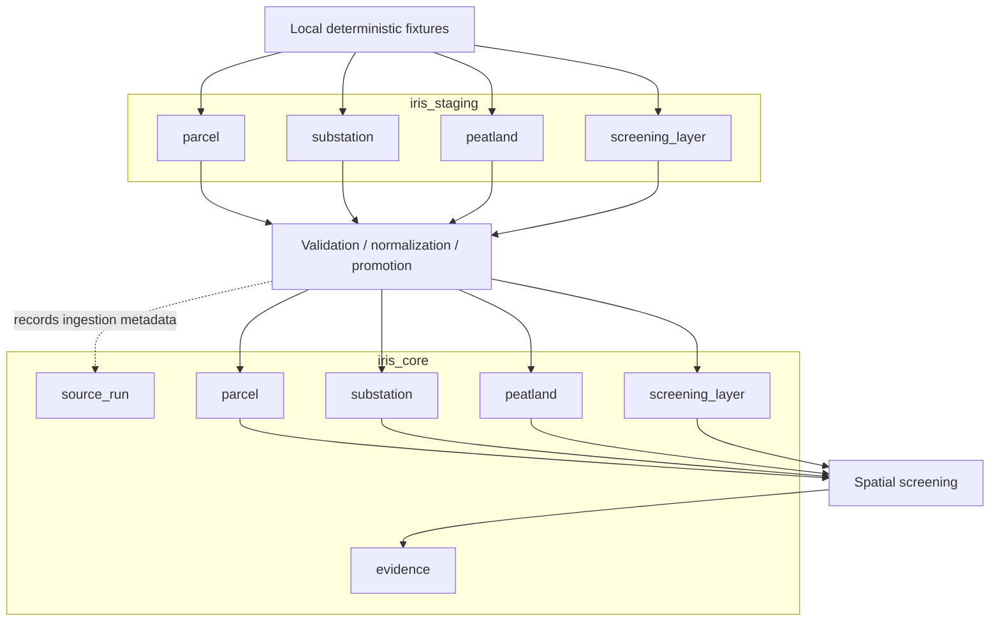

# Overall System Architecture

The IRIS pilot uses a controlled staging-to-core architecture.



The primary flow is:

```text
fixtures
→ iris_staging
→ validation / normalization / promotion
→ iris_core
→ spatial screening
→ iris_core.evidence
→ verification
→ automated tests
```

## Responsibility Boundaries

### `iris_staging`

Staging stores incoming/source-shaped business records.

It is intentionally more permissive than core for geometry typing and source CRS,
but still requires `country_code` for persisted business entities.

Typical responsibilities:

- receive deterministic source-shaped records
- preserve incoming source metadata
- preserve source CRS
- remain separate from canonical downstream data

### Promotion

Promotion is the boundary between source-shaped and canonical data.

It is responsible for:

- validating required values
- mapping source identifiers to canonical references
- linking rows to `source_run`
- normalizing geometry type
- transforming CRS where necessary
- inserting valid records into `iris_core`

Promotion is transactional and insert-only for immutable fixtures. Existing business
records are retained on conflict; changing fixtures requires a rebuild.

### Screening

Screening runs after promotion and persists deterministic positive results in
`iris_core.evidence`. It remains separate from migrations and fixture loading.
Repeated screening updates the same logical evidence rows through their unique key.

### `iris_core`

Core contains canonical data used for downstream spatial screening.

It enforces:

- country-aware identity
- country-scoped relationships
- canonical geometry contracts
- canonical CRS
- relational and spatial indexes

Geometry constraints reject invalid or empty shapes. Source-run foreign keys also
enforce matching source IDs and dates for spatial entities.

Geometry GiST indexes support intersections; a substation geography expression index
supports metre-based proximity predicates.

### Verification

Verification queries demonstrate the implemented behavior without changing the intended
database state.

Verification displays persisted evidence and recomputes the spatial predicates and
distance so reviewers can compare stored results with current core geometry.

### Automated tests

Automated tests are split into database-constraint, geometry/CRS, and spatial
screening/evidence files. Each file uses its own transaction and rollback, and failures
return a non-zero exit code. Verification runs before the tests in the `all` workflow,
but the tests query the database independently rather than consuming verification output.
