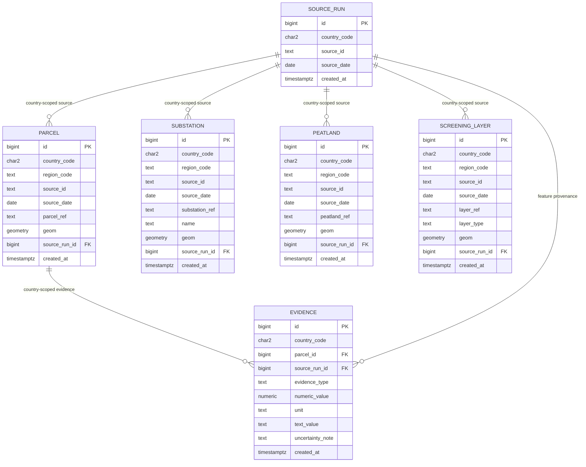

# Relational Schema and Key Design

## Core ER Diagram



The ER diagram models relational relationships only.

Spatial relationships are computed from geometry.

## Staging Schema

`iris_staging` contains source-shaped `parcel`, `substation`, `peatland`, and
`screening_layer` tables. Their geometry columns are deliberately generic so source
CRS and geometry shape can be preserved until promotion. Staging rows use
`external_id`; promotion maps it to the corresponding core reference column.

## Primary Keys

Core entities use surrogate numeric primary keys:

```text
PRIMARY KEY (id)
```

These simplify internal references and do not replace business-key constraints.

## Country-Scoped Business Identity

Business identity includes `country_code`.

Examples:

```text
parcel
UNIQUE (country_code, source_id, parcel_ref)

substation
UNIQUE (country_code, source_id, substation_ref)

peatland
UNIQUE (country_code, source_id, peatland_ref)

screening_layer
UNIQUE (country_code, source_id, layer_ref)
```

This allows the same external identifier to exist in different countries while
preventing duplicate business identity within the same country/source scope.

## Core Geometry Contracts

| Table | `geom` type | Constraint |
|---|---|---|
| `iris_core.parcel` | `geometry(MultiPolygon, 4326)` | `ck_parcel_geom` |
| `iris_core.substation` | `geometry(Point, 4326)` | `ck_substation_geom` |
| `iris_core.peatland` | `geometry(MultiPolygon, 4326)` | `ck_peatland_geom` |
| `iris_core.screening_layer` | `geometry(MultiPolygon, 4326)` | `ck_screening_layer_geom` |

Each named constraint is defined with its table and requires `ST_IsValid(geom)` and
`NOT ST_IsEmpty(geom)`.

## Country-Scoped Foreign Keys

Reference targets include:

```text
UNIQUE (country_code, id)
```

where needed for composite references.

Spatial entities also use a provenance reference target:

```text
UNIQUE (country_code, id, source_id, source_date)

(country_code, source_run_id, source_id, source_date)
→ source_run(country_code, id, source_id, source_date)
```

This prevents a spatial entity from referencing a source run with a different source
ID or date, even within the same country.

Evidence references the parcel in the same country:

```text
evidence(country_code, parcel_id)
→ parcel(country_code, id)

evidence(country_code, source_run_id)
→ source_run(country_code, id)
```

This prevents accidental cross-country relationships.

## Evidence Identity and Provenance

Persisted screening evidence is unique by:

```text
UNIQUE (
    country_code,
    parcel_id,
    source_run_id,
    evidence_type,
    text_value
)
```

`text_value` stores the related peatland, screening-layer, or substation reference.
`source_run_id` identifies that related feature's source run. This keeps evidence
country-scoped and allows repeated screening to update the same logical result.

The pilot screening SQL always supplies `text_value`. The column remains nullable so
the evidence contract can also represent a numeric-only result. The table requires at
least one value, and a numeric value requires a unit:

```text
CHECK (numeric_value IS NOT NULL OR text_value IS NOT NULL)
CHECK (numeric_value IS NULL OR unit IS NOT NULL)
```

The related feature reference is not a foreign key because it can identify one of
three feature tables. The screening SQL and automated tests enforce that mapping.

## Indexes

The four core spatial tables have GiST indexes on `geom`. Substation also has a GiST
expression index on `geom::geography` for the metre-based proximity predicate.
Evidence has relational indexes on `(country_code, parcel_id)` and
`(country_code, source_run_id)`; its logical identity constraint supplies the unique
index used by screening upserts.

## Source Run

`source_run` records minimal ingestion provenance.

Each country/source/date group is one logical run. Its `created_at` is the earliest
staging creation timestamp represented by that group when first promoted.

The pilot uses:

```text
id
country_code
source_id
source_date
created_at
```

A production model could allow multiple independent ingestion attempts for the same
source/date and carry richer operational metadata.
