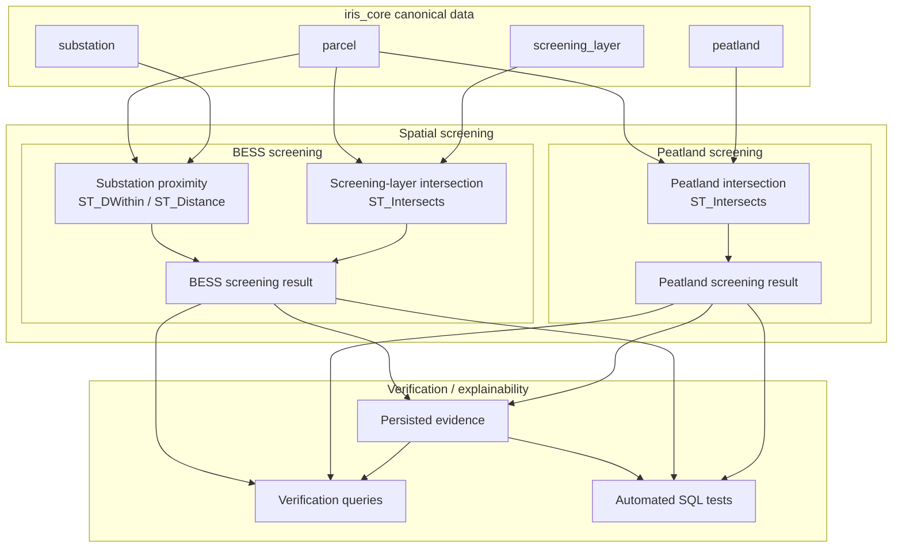

# Spatial Workflows

The pilot demonstrates two main spatial screening paths:

- BESS-related screening
- peatland screening



The SQL-only screening stage runs after core promotion and persists positive results
in `iris_core.evidence`. Verification remains read-only and compares those rows with
fresh spatial calculations.

## Parcel ↔ Peatland

Intersection is derived with:

```sql
ST_Intersects(parcel.geom, peatland.geom)
```

Expected deterministic fixture behavior:

```text
PARCEL-001 intersects PEAT-001
PARCEL-002 does not intersect PEAT-001
```

## Parcel ↔ Screening Layer

Generic screening-layer intersection is derived with:

```sql
ST_Intersects(parcel.geom, screening_layer.geom)
```

Expected fixture behavior:

```text
PARCEL-001 intersects SCREEN-001
PARCEL-002 does not intersect SCREEN-001
```

## Parcel ↔ Substation

Proximity is measured with `ST_DWithin` or `ST_Distance`.

Because core geometry is stored in EPSG:4326, metric operations use `geography`
or an appropriate projected CRS.

Example:

```sql
ST_DWithin(
    parcel.geom::geography,
    substation.geom::geography,
    500
)
```

The threshold is a deterministic demonstration value only.

Expected fixture behavior:

```text
PARCEL-001 → SUB-001 = approximately 143.38 m; within 500 m
PARCEL-002 → SUB-001 = approximately 3065.41 m; outside 500 m
```

## Persisted Evidence

The fixture screening stage produces:

```text
PARCEL-001 → peatland_intersection → PEAT-001
PARCEL-001 → screening_layer_intersection → SCREEN-001
PARCEL-001 → substation_distance → SUB-001 → 143.38 m
```

`text_value` carries the related feature reference. Intersection evidence uses no
numeric value or unit. Distance evidence uses metres and geography calculations.
The stored distance is rounded to two decimal places. `PARCEL-002` produces no
evidence because none of its fixture relationships meet the positive screening rules.
Each row uses the related feature's source run for provenance and carries the pilot's
preliminary-screening uncertainty note. `ON CONFLICT DO UPDATE` makes reruns
idempotent. Fixture changes require a rebuild to remove results that no longer match.

## Spatial Indexing

Core geometry columns used by spatial screening have GiST indexes.

These geometry indexes support intersection predicates. Substation proximity uses
`geom::geography`, with a matching GiST expression index on the substation table;
the geometry index alone does not index that geography expression.

The fixture dataset is very small, so PostgreSQL may legitimately choose a sequential
scan in `EXPLAIN`.

Verification therefore demonstrates:

- index existence
- representative query plans

without asserting one specific planner choice.
